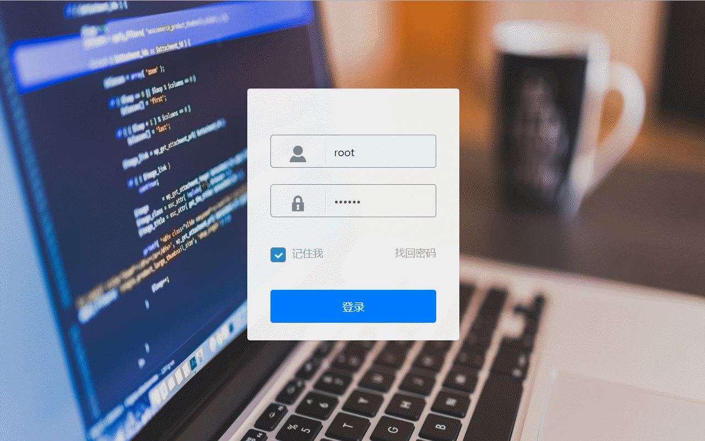

### 快环境项目说明
    快环境项目总结：
    1.页面大概13个左右分别为 登录页、文件管理、数据库、监控、CPU监控、内存监控、磁盘io监控、网络监控、一键放置网站、回收站、退出
    2.所用技术：
      jquery 3+
      adminlte.js
      bootstrap-table.js  1.13.5
      echarts.js 3+
      版本管理 svn
    3.项目分配
       严波 项目负责人 主要负责项目搭建 技术指导 项目测试 等

       李凯晴 负责整个项目的UI
       登录UI及验证及ajax请求 找回密码页面的所有html、css、js以其它整个项目的图标css样式调整

       张辉 负责首页 表格的数据通信及用户增删改查的操作、以及echart饼图和柱图的数据渲染

       范玉伟 负责文件管理 负责研究文件管理页面的技术难点为以后的项目成员接手打下咯基础、以及登录页面的记住密码功能

    4.效果如下：

